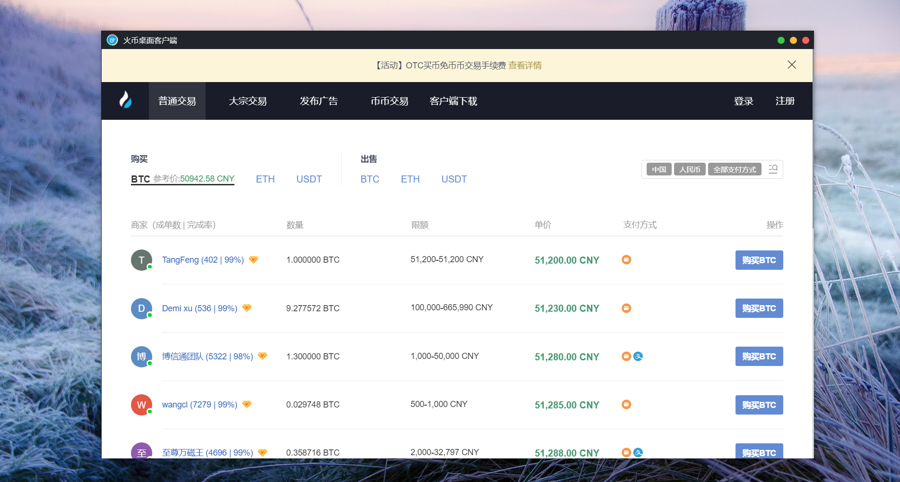

# 火币桌面客户端





## run

项目基于 [electron-vue](https://github.com/SimulatedGREG/electron-vue) 模板开发。


**安装依赖：**

```bat
npm install
```

**以dev方式运行：**

```bat
npm run dev
```

**打包成可执行文件：**

```bat
npm run build
```

打包需要等待几分钟，打包生成可执行文件在项目里的 `build` 文件夹下；

`build/win-unpacked` 文件夹为免安装可执行文件；

`build/火币桌面客户端 Setup 1.1.0.exe` 为安装文件。


# 百度网盘地址
打包构建后的应用程序（运行火币桌面客户端 Setup 1.1.0.exe）：<a href="https://pan.baidu.com/s/1UCaYFELH8wMGUPxhcoHn-Q" target="_blank">百度网盘下载</a>